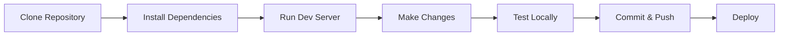

# Furniture Logistics

A modern furniture logistics management system built with Next.js to streamline furniture delivery, tracking, and management operations.

## 🚀 Project Stack

### Frontend
- **Next.js** - React framework for production-grade applications
- **React** - UI component library
- **Tailwind CSS** - Utility-first CSS framework
- **JavaScript/JSX** - Modern JavaScript with JSX syntax

### Development Tools
- **ESLint** - Code linting and quality assurance
- **PostCSS** - CSS transformation tool
- **next/font** - Automatic font optimization with Geist font family

### Package Manager
- npm / yarn / pnpm / bun (flexible package manager support)

## ✨ Features

### Core Functionality
- 🚚 **Logistics Management** - Track and manage furniture deliveries
- 📦 **Order Processing** - Streamlined order workflow
- 👤 **User Authentication** - Secure user management system
- 📊 **Dashboard** - Real-time logistics overview
- 📱 **Responsive Design** - Mobile-first approach
- ⚡ **Fast Performance** - Optimized with Next.js features

### Technical Features
- Server-side rendering (SSR)
- Static site generation (SSG)
- API routes for backend functionality
- Automatic code splitting
- Hot module replacement
- Font optimization

## 🔄 Workflow

### Development Workflow



### Application Workflow

1. **User Registration/Login**
   - Users authenticate through the system
   - User data is validated and stored

2. **Order Creation**
   - Customers create furniture delivery orders
   - Order details are captured and processed

3. **Logistics Management**
   - Orders are assigned to delivery personnel
   - Real-time tracking is enabled

4. **Delivery Execution**
   - Delivery status updates
   - Route optimization
   - Customer notifications

5. **Completion & Feedback**
   - Order completion confirmation
   - Customer feedback collection

## 🛠️ Getting Started

### Prerequisites
- Node.js 18.x or higher
- npm / yarn / pnpm / bun

### Installation

1. Clone the repository:
```bash
git clone https://github.com/Shahzaib-Gulfraz/furniturelogistic.git
cd furniturelogistic
```

2. Install dependencies:
```bash
npm install
# or
yarn install
# or
pnpm install
# or
bun install
```

3. Run the development server:
```bash
npm run dev
# or
yarn dev
# or
pnpm dev
# or
bun dev
```

4. Open [http://localhost:3000](http://localhost:3000) with your browser to see the result.

### Development

- Edit pages by modifying files in the `src/app` directory
- The page auto-updates as you edit the file
- API routes can be created in `src/app/api`

## 📁 Project Structure

```
furniturelogistic/
├── public/              # Static assets
├── src/
│   └── app/            # Next.js App Router pages
├── check_user_temp.js  # User validation utilities
├── package.json        # Project dependencies
├── next.config.mjs     # Next.js configuration
├── tailwind.config.js  # Tailwind CSS configuration
├── postcss.config.mjs  # PostCSS configuration
└── eslint.config.mjs   # ESLint configuration
```

## 📚 Learn More

To learn more about the technologies used:

- [Next.js Documentation](https://nextjs.org/docs) - learn about Next.js features and API
- [Learn Next.js](https://nextjs.org/learn) - interactive Next.js tutorial
- [Tailwind CSS](https://tailwindcss.com/docs) - utility-first CSS framework
- [React Documentation](https://react.dev) - learn React

## 🚀 Deployment

### Deploy on Vercel

The easiest way to deploy your Next.js app is to use the [Vercel Platform](https://vercel.com/new?utm_medium=default-template&filter=next.js&utm_source=create-next-app&utm_campaign=create-next-app-readme) from the creators of Next.js.

[](https://vercel.com/new/clone?repository-url=https://github.com/Shahzaib-Gulfraz/furniturelogistic)

Check out the [Next.js deployment documentation](https://nextjs.org/docs/app/building-your-application/deploying) for more details.

## 🤝 Contributing

Contributions, issues, and feature requests are welcome!

## 📝 License

This project is open source and available under the MIT License.

## 👤 Author

**Muhammad Maaz Younas**
- GitHub: [@maazyounas](https://github.com/maazyounas)

---
